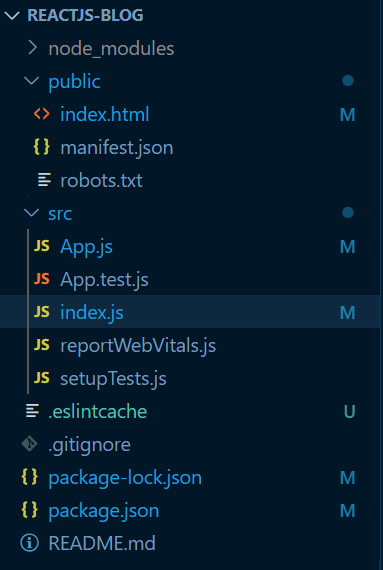
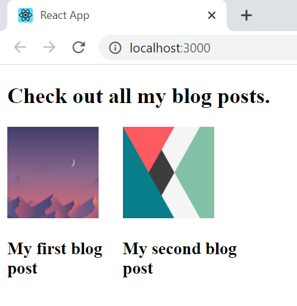
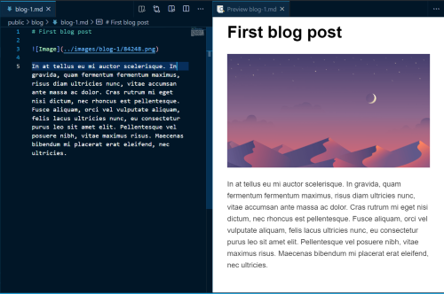

# How to build a static blog site using ReactJS

Hi folks, this is my first blog post. I will show you how to create your own website for your killer blog. In this tutorial, we will cover the most important aspect of building a blog site in detail - how to render a static blog post into the browser. I will also provide instructions on hosting your blog site for free on github in a later post.

Let's create a project named `reactjs-blog` using `create-react-app`:

```
create-react-app reactjs-blog
```

Change the current directory to `reactjs-blog`:

```
cd reactjs-blog
```

Now, Launch the following command in your terminal:

After the installation finishes, open the source code in an editor of your choice. Launch the following command if you use visual studio code like me:

```
code .
```
Now start your local development server:

```
npm start
```

Now, remove some of the files that come by default with `create-react-app`. After removing the files, your directory structure should somewhat look like this:



Also, don't forget to remove unnecessary file imports/links from the `.js` and `.html` files (e.g, App.css, index.css, logo.svg, favicon.ico etc.).

Alright, we're now ready to code our application. Let's start by defining the data for our app. Go ahead and create a `data.json` file in the `public` folder of your project. In the file paste the following content:

```
{
  "posts": [
    {
      "id": 1,
      "title": "My first blog post",
      "thumbnail": "picture1.png",
      "mdFile": "first.md"
    },
    {
      "id": 2,
      "title": "My second blog post",
      "thumbnail": "picture2.png",
      "mdFile": "second.md"
    }
  ]
}
```

Each post will have a unique `id`, `title` and a `thumbnail`. Our homepage will display a list of all the posts with their thumbnail and title. We will be using markdown files for rendering the blog posts onto a webpage. So, each post will have a `.md` file that will hold it's content. If the user clicks on one post, the content of that post will open in a new page. Don't forget to download placeholder images for `picture1.png` and `picture2.png` in the `public` folder of your project.

Before going to the next step, make sure that you have `react-router-dom` installed:

```
npm install --save react-router-dom
```

The next step is to get the layout ready for our homepage. Create a `Posts.js` file under the `src` folder of your project. Also create a `Posts.css` file in the same folder. Now, paste the following code inside `Posts.js`:

```
import React from "react";
import { Link } from "react-router-dom";
import "./Posts.css";

export default function Posts(props) {
  if (props.data) {
    return (
      <div>
        <h2>Check out all my blog posts.</h2>
        {props.data.posts.map((post) => {
          const url = "/" + post.title.toLowerCase().split(" ").join("-");
          return (
            <div className="post">
              <Link key={url} to={url}>
                <div>
                  
                </div>
              </Link>
              <h3>{post.title}</h3>
            </div>
          );
        })}
      </div>
    );
  }
  return <div>Loading...</div>;
}

```
This code has a pretty straightforward logic. We're passing data to our component through props. If there's data available in the props, we will render a list of clickable images along with their title. Otherwise, we'll just show a `Loading...` text for now. We're also assigning a unique URL to our posts based on the title. If the title of a post is `My first post`, it's corresponding link will route to `/my-first-post`. 

Now add the following lines to `Posts.css` for styling the homepage:

```
.thumbnail{
    width: 100px;
    height: 100px;
}
.post{
    display: inline-block;
    width: 10%;
}
```

Before proceeding to the next step, make sure that you have `jquery` installed: 

```
npm install --save jquery
```

It's now time to fetch the data from `data.json` file that we had created in the beginning. Modify your `index.js` file as below:

```
import $ from "jquery";
import React from "react";
import ReactDOM from "react-dom";
import App from "./App";
import reportWebVitals from "./reportWebVitals";
import { BrowserRouter } from "react-router-dom";

$.ajax({
  url: "./data.json",
  dataType: "json",
  cache: false,
  success: function (data) {
    ReactDOM.render(
      <BrowserRouter>
        <App data={data} />
      </BrowserRouter>,
      document.getElementById("root")
    );
  },
  error: function (xhr, status, err) {
    console.log(err);
    alert(err);
  },
});
reportWebVitals();

```

This piece of code fetches data from `data.json` file that we created earlier and renders our `App` component. The `App` component recieves this data and simply renders our `Posts` for now. Following should be the contents of your `App.js` file:

```
import Posts from "./Posts";

function App(props) {
  return (
    <div className="App">
      <Posts data={props.data} />
    </div>
  );
}

export default App;

```
If you check your browser now, you should see a page like this:



If you click on the link, you will just see the homepage being re-rendered for now. This is because we haven't defined any routes for our posts. Let's change this by first adding markdown files for our blog posts. Add a `first.md` file to the `public` folder of your project. In the `first.md` file, write the content of your blog post in markdown format. If you use visual studio code, I would recommend you to install [Markdown Preview Enhanced](https://marketplace.visualstudio.com/items?itemName=shd101wyy.markdown-preview-enhanced) for previewing the HTML while you write your blog post.

The next step is to create a `BlogPost.js` file and use it to render the content of our blog posts. Also, make sure that you have `marked` package installed. We will use `marked` for rendering the `.md` file into HTML. Now, run the following command:

```
npm install --save marked
```

Paste the following content into `BlogPost.js` file:

```
import React, { Component } from "react";
import marked from "marked";
import $ from "jquery";

export default class BlogPost extends Component {
  constructor(props) {
    super(props);
    this.state = {};
  }

  render() {
    const { markdown } = this.state;
    return (
      <div className="blogPost">
        <article dangerouslySetInnerHTML={{ __html: markdown }}></article>
      </div>
    );
  }

  getBlogData() {
    $.ajax({
      url: `./${this.props.mdFile}`,
      dataType: "text",
      cache: false,
      success: function (text) {
        this.setState({ markdown: marked(text) });
      }.bind(this),
      error: function (xhr, status, err) {
        console.log(err);
        alert(err);
      },
    });
  }

  componentDidMount() {
    this.getBlogData();
  }
}

```

We're using `jQuery` to fetch the markdown from the `public` folder. The markdown text is a state variable which is set as soon as the data fetch is complete.

Modify the `App.js` file to look like this:

```
import Posts from "./Posts";
import { Switch, Route } from "react-router-dom";
import BlogPost from "./BlogPost";

function App(props) {
  return (
    <div className="App">
      <Switch>
        <Route
          exact
          path="/"
          render={(renProps) => (
            <div>
              <Posts {...renProps} data={props.data} />
            </div>
          )}
        />
        {props.data.posts.map((post) => {
          var url = "/" + post.title.toLowerCase().split(" ").join("-");
          return (
            <Route
              exact
              key={post.id}
              path={url}
              render={(renProps) => (
                <div>
                  <BlogPost {...renProps} mdFile={post.mdFile} />
                </div>
              )}
            />
          );
        })}
      </Switch>
    </div>
  );
}

export default App;

```

For each post in `props`, we define a unique `Route` using the `map` function. After this step, you'll be able to click on the blog post and it will be rendered on a new page. A sample with markdown text and rendered HTML is shown below:



I hope you enjoyed the tutorial! Feel free to e-mail me at staveesh08@gmail.com and share your thoughts! Stay tuned for more content. Till then, goodbye!